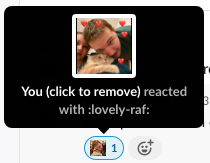

# Lovely

`Lovely` is a python library that inserts emojis to images with a face, an unexpected way to improve team morale and
engagement. Example of usage in slack:

This library uses face detection via OpenCV, so emojis don't cover face.

## How to add emoji to Slack?

Here is the [Slack tutorial](https://slack.com/help/articles/206870177-Add-custom-emoji-and-aliases-to-your-workspace)

## Example of work

 ->

## Requirements

1. Python 3
2. Run `pip install -r requirements.txt` (opencv, numpy, optional slack sdk). If you don't want to install/use slack
   sdk, you can remove it from requirements.txt.

## How to run script

Default usage: script will output an image with `-lovely` suffix and ❤️ emojis: `python main.py path/to/image.jpeg`

[WIP] To customize emojis pass style parameter: [`lovely`, `rage`, `sad`] or `all`(will generate images for all styles).
Example: `python main.py path/to/image.jpeg rage`

### Why insert emoji image and not just ❤️?

I tried to use `Pillow` to write emojis directly, but it doesn't work as expected. If you want to fix it, just do it.

## Slack part

To add an emoji to a slack workspace one needs `admin.emoji.add` access which is part of `admin.teams:write` scope. It's
highly unlikely that anyone will install a Slack app with such scope for just emoji, so the implementation looks like
this:

1. Anyone installs the app to a workspace
2. A user who wants to add a emojis to a workspace sends a message to the app with a photo(s).
3. The app responds with a message to the user with `lovely` emojis on the input photo(s(), which they can use later
   when adding an emoji.

### How to run slack part

To run slack part, export env params with your app values: `SLACK_SIGNING_SECRET` and `SLACK_BOT_TOKEN` and
run `python slack.py`.